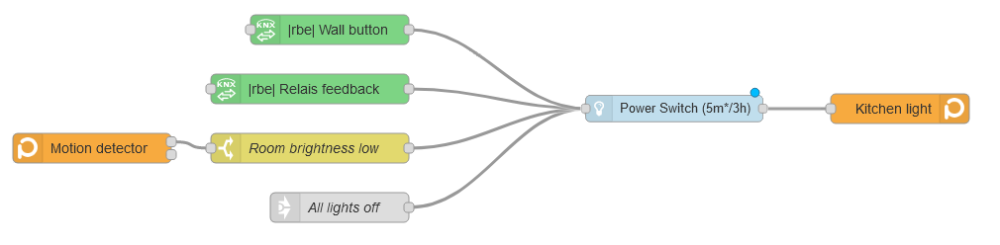
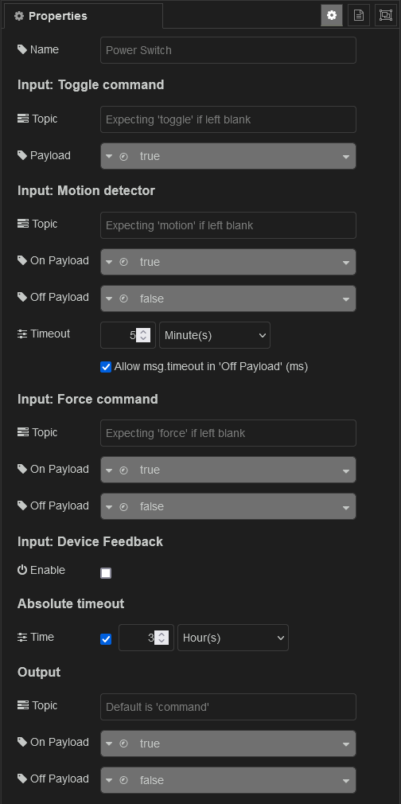

## Power Switch
This node enables you to control anything, which can be controlled with an on and off command, quite comfortably. Control your device with the use of a toggle button or force the output with on/off commands. You can use one or more motion detectors and configure a relevant timeout. Configure a timer, after which the device will be turned off, and never forget anymore to power off your light. Send the actuator feedback to the block for more smart features. Once installed, find details in the node manual (or [preview raw on GitHub](https://github.com/danube/node-red-contrib-smarthome-powerswitch/blob/81de2557f156b98480ec00a5bf342f443455933e/nodes/powerswitch.html).)

### Example

### Properties

## Smart Home Collection
A collection of nodes relevant to control your smart home will be published soon under the name "node-red-contrib-smarthome". This node "powerswitch" is the first released output. The next will be a shading node to control your window blinds. Other scheduled nodes are a light dimmer, alarm system and more. These will be also published together under the name "node-red-contrib-smarthome" as well as independant nodes. So stay tunded @ https://github.com/danube.