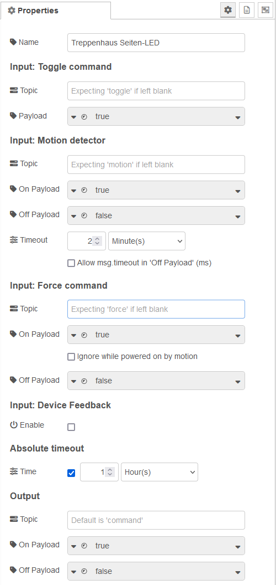

# Power Switch

**This node enables you to control anything, which can be controlled with an on and off command, quite comfortably.**

Control your device with the use of a **toggle button** or **force the output** with on/off commands. You can use one or more **motion detectors** and **configure a relevant timeout**. Configure a timer, after which the **device will be turned off**, and never forget anymore to power off your light. Send the **actuator feedback** to the block for more smart features.

The **node title** shows either "Power Switch" or the configured name, together with the time settings. First value shows the configured timeout, followed by a star, if the option "Override with msg.timeout at 'Off Payload'" is enabled. Second value shows the absolute timeout, if enabled. Examples:

* "Power Switch (2m*/1h)" - No individual name given, 2 minutes timeout, override enabled, 1 hour absolute timeout.
* "Kitchen light (3m)" - Individual name "Kitchen light given", 3 minutes timeout, no override, no absolute timeout.

Once installed, find details in the node manual (or [preview raw on GitHub](https://github.com/danube/node-red-contrib-smarthome-powerswitch/blob/81de2557f156b98480ec00a5bf342f443455933e/nodes/powerswitch.html).)

You may also be interested in the **exmaples** coming with the installation. Once installed, in Node-RED go to "Import", choose "Examples" and expand "node-red-contrib-smarthome-powerswitch".

## Example

## Properties

## Changelog

See [CHANGELOG.md](CHANGELOG.md)
